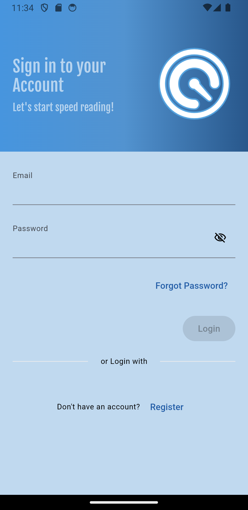
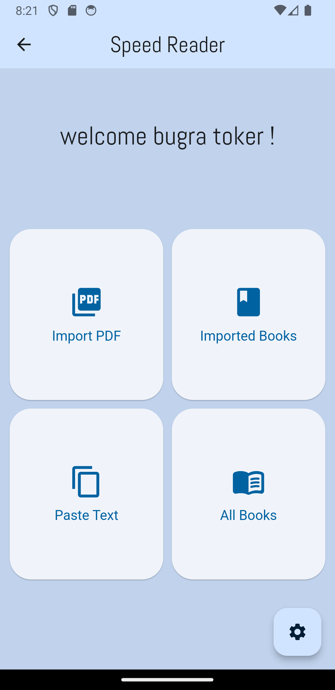
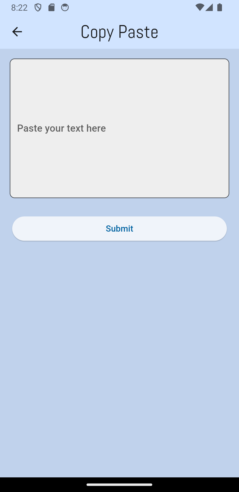
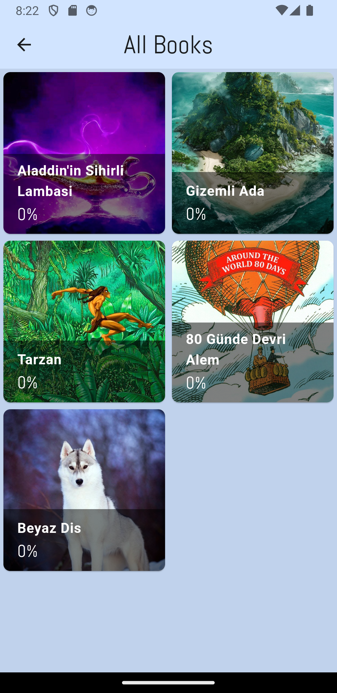
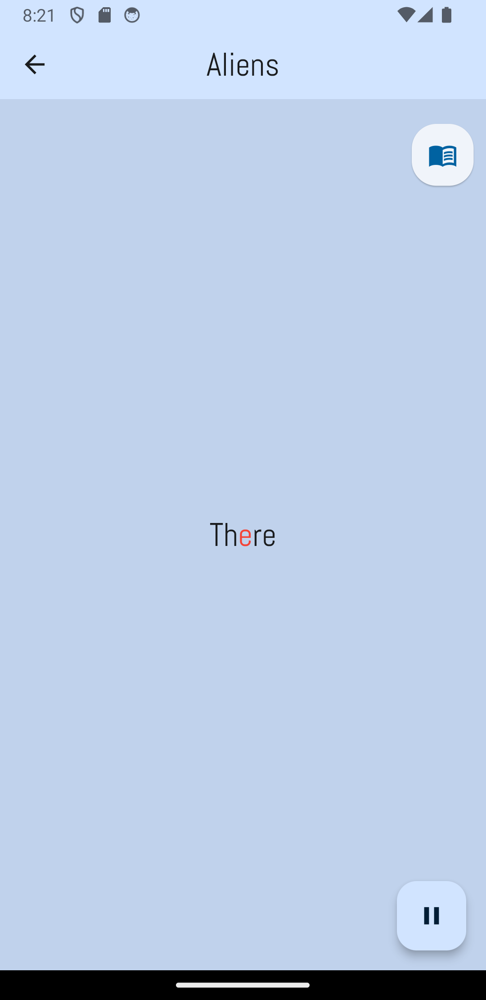
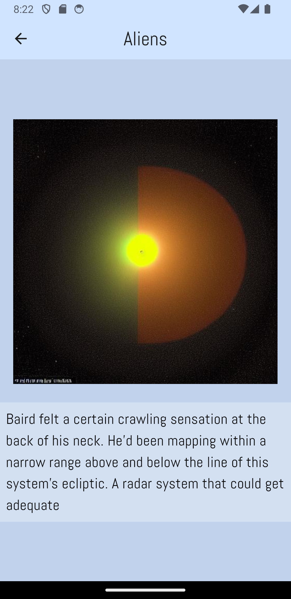
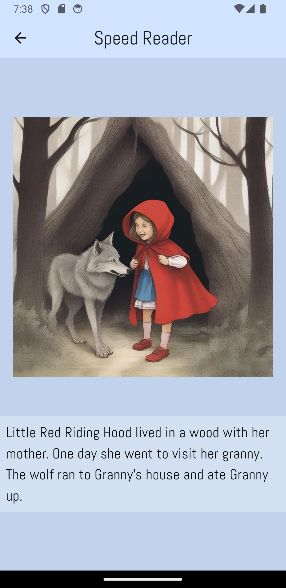
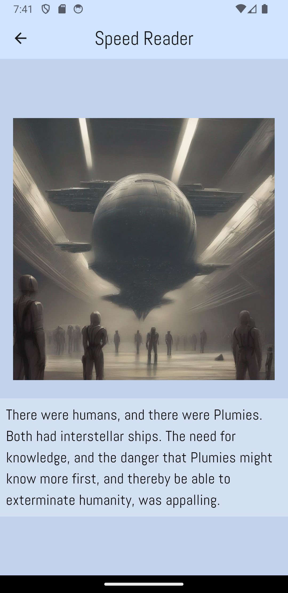

# 👀 Speed Reader

**Speed Reader** is a mobile application designed to enhance reading speed and make reading a fun activity. This project is supported by **TÜBİTAK 2209-A** and was developed independently by Alp Bugra Toker.

## Overview

Speed Reader leverages the **Rapid Serial Visual Presentation (RSVP)** method, where words are displayed sequentially, one at a time, at a fixed location on the screen. This method significantly improves reading speed. Additionally, the application enhances the reading experience with **text-to-image integration**, which helps users visualize content better and maintain interest. 

- After reading every 150 words of text, an image is generated based on those 150 words and displayed on the screen along with a summary. When the user clicks the screen, they continue reading, and the next 150 words are processed to generate another image. I determined the word count to be 150 because of the speed of the model. If I build a faster text-to-image model, images can be generated more frequently.

## Features

- 🚀 **Increased Reading Speed**: Utilizes RSVP to present text efficiently.
- 🎨 **Enhanced Visualization**: Integrates text with images to improve comprehension and engagement.
- 🤖 **AI-Powered Summarization**: Uses AI models to provide summaries of long texts.
- 🖼️ **Text-to-Image Conversion**: Converts text into images for better visualization.

## Technology Stack

- 📱 **Mobile Interface**: Developed using Flutter.
- 💻 **Backend Services**: Implemented with .NET and PostgreSQL.
- 🧠 **AI Models**: Used for summarization and text-to-image conversion.

## Development Approach

The backend application is built using **Domain Driven Design (DDD) principles**, ensuring a robust and scalable architecture.

## Screenshots

### Sign In Page and Home Page 
<table>
  <tr>
    <td></td>
    <td></td>
  </tr>
</table>

### Imported Books, Copy Paste and (Default) All Books Screen
<table>
  <tr>
    <td></td>
    <td></td>
    <td></td>
  </tr>
</table>

### Reading Page
<table>
  <tr>
    <td></td>
  </tr>
</table>

### Generated Images
<table>
  <tr>
    <td></td>
    <td></td>
    <td></td>
  </tr>
</table>

## Acknowledgements

This project is supported by **TÜBİTAK 2209-A**.

## Developer

- 👨‍💻 **Alp Bugra Toker** - 2024

